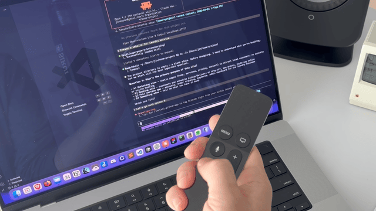
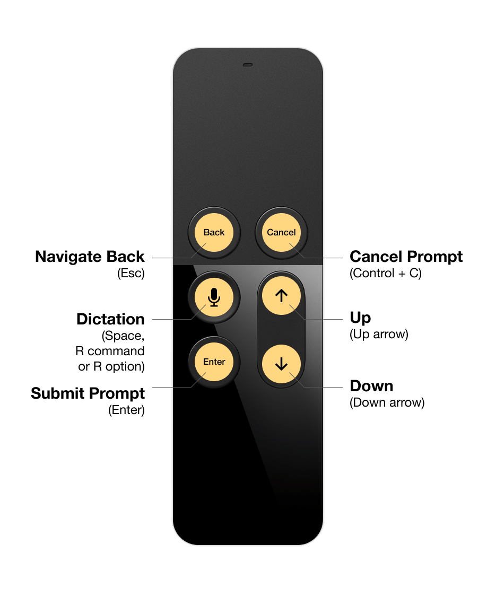
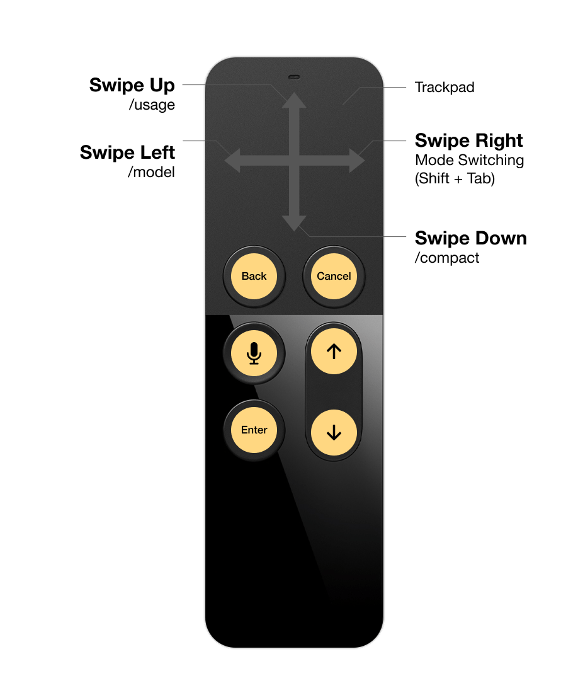
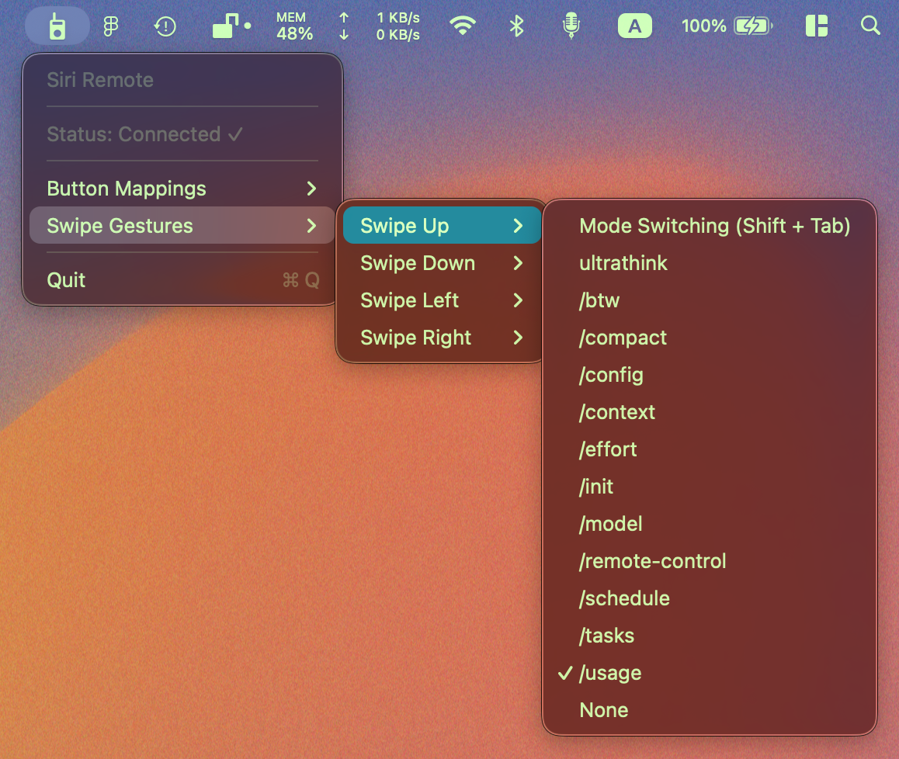

[English](README.md)

# Mavrick V0.1

用 Apple TV 遥控器单手操控 Claude Code，按键与手势均可自定义。

拿起遥控器，按住说话，不打断思路地对话编码。



已在初代 Siri Remote（A1513, `0x0266`）及新款型号（`0x026D`）上测试通过。

> **实验版本。** 目前 Mavrick 仍处于实验阶段，不提供预编译二进制文件，需自行构建（见[构建说明](#构建)）。

---

## 功能特性

### 按键映射

每个 Siri Remote 物理按键可通过菜单栏独立配置。




**默认映射（可自定义）：**
- Menu → Esc
- TV → Ctrl + C
- Siri → Space（Claude 语音输入）
- Play/Pause → Enter
- Volume Up → ↑
- Volume Down → ↓

| 按键 | 行为 |
|---|---|
| Play/Pause | Enter（提交指令） |
| Volume Up | ↑（向上一行） |
| Volume Down | ↓（向下一行） |
| Menu | Esc（返回） |
| TV | Ctrl + C（取消指令） |
| 触控板点击 | 鼠标左键 |
| Siri/麦克风 | 按住空格（需启用 Claude 语音输入） |

**支持长按的按键：** 按住说话需要同时有按下和释放的 HID 事件。仅 Play/Pause、Volume Up、Volume Down、Siri 四个键支持。语音输入选项包括：空格（Claude Code）、Fn/Globe（微信等第三方语音输入）、Right Command、Right Option。与 [VoiceInk](https://github.com/Beingpax/VoiceInk) 兼容。

**新增按键：** Tab 键（代码补全 / 接受建议）可用于所有按键。

### 滑动手势

触控板支持四个方向的单指滑动。触发条件：**滑动距离 ≥ 触控板 35%**，**时长 < 350ms**，**主方向 ≥ 另一方向的 2 倍**。缓慢拖动仍控制光标，只有快速滑动才触发动作。





**默认手势映射（可自定义）：**
- 上滑 → `/usage`
- 下滑 → `/compact`
- 左滑 → `/model`
- 右滑 → Mode Switching (Shift + Tab)

可分配动作：

- **方向箭头**：「Left」仅在上滑选项中出现，「Right」仅在右滑选项中出现
- **Mode Switching (Shift + Tab)** — 切换 Claude Code 的 normal / plan / auto-accept 模式
- **`ultrathink`** — 插入关键字（带尾部空格）
- **斜杠命令**：`/btw`、`/compact`、`/config`、`/context`、`/effort`、`/init`、`/model`、`/remote-control`、`/schedule`、`/tasks`、`/usage`
- **None**（无动作）

**尾部空格策略：** 通常需要追加参数的命令（`/btw`、`/schedule`、`ultrathink`）带尾部空格，方便继续输入。独立命令或弹出交互面板的命令（`/compact`、`/config`、`/context`、`/effort`、`/init`、`/model`、`/remote-control`、`/tasks`、`/usage`）不带空格。

**绝不自动发送回车** — 手势只输入命令，回车留给你自己按，方便检查、修改或补充参数。

### 其他触控功能

- **光标移动**：单指拖动
- **双指滚动**：自然方向，可调速度
- **轻触即可点击**：触控板表面
- **拖拽**：按住触控板点击并移动

### 持久化

按键映射和手势映射保存在 UserDefaults（`buttonMappings`、`swipeMappings`），重启后保持不变。Schema 版本管理确保未来升级兼容（`buttonMappingsSchema`）。

### 安全保障

- **防按键卡死。** 遥控器断开时，Mavrick 自动释放按住说话对应的虚拟按键。
- **自动自愈。** HID 释放事件丢失时，下次按下会先释放之前的残留状态。
- **HID 独占。** 连接时 Mavrick 在 HID 层级独占遥控器，macOS 不再看到媒体键事件，不会出现重复派发或系统报错音。

---

## 构建

### 前置条件

- macOS 11 (Big Sur) 或更高版本
- Xcode Command Line Tools：`xcode-select --install`

### 构建命令

```bash
./build.sh
```

脚本使用 `swiftc` 一次性编译所有 Swift 文件，通过桥接头文件链接 IOKit、CoreGraphics、AudioToolbox、Carbon、AppKit 及 Apple 私有框架 MultitouchSupport，不需要 Xcode 工程。

---

## 安装运行

1. 构建并打包：`./build.sh && ./create_app_bundle.sh`
2. 将 `Mavrick.app` 拖入 `/Applications`（可选，但有助于图标缓存）
3. 启动：`open Mavrick.app`
4. 在 **系统设置 → 隐私与安全性** 中授予权限：
   - **辅助功能**（模拟键盘和鼠标事件）
   - **输入监控**（读取 HID 事件）
   - **蓝牙**（连接遥控器）
5. 在 **系统设置 → 蓝牙** 中配对 Siri Remote（如尚未配对）
6. 点击菜单栏图标 → Button Mappings / Swipe Gestures 进行配置

> ⚠️ **重要：** 必须在 **系统设置 → 隐私与安全性 → 输入监控** 中点击 **+** 手动添加 **Mavrick.app**，否则 Mavrick 可能无法正确拦截 HID 事件，导致音量键和播放键触发系统音量调节或 Apple Music。

调试日志写入 `/tmp/mavrick.log`（Hardened Runtime 下 NSLog 会被截断，因此采用文件日志）。

---

### 同一按键为何有两条路径？

Siri Remote 的一次物理按键可能通过两个路径到达：

1. **HID（已独占）** — `RemoteInputHandler` 读取原始 HID 输入
2. **AVRCP → NX_SYSDEFINED** — `MediaKeyInterceptor` 通过事件拦截获取蓝牙媒体键事件

两条路径通过 200ms 防抖（`RemoteInputHandler` 上静态的 `lastProcessedButton`/`lastProcessedTime`）自动去重，每次按键只触发一次映射动作。

### NX_SYSDEFINED 黑魔法（媒体键）

macOS 没有公开 API 来合成或拦截媒体键（Play/Pause、Next、Previous、Volume、Mute）。`MediaKeyInterceptor` 和 `MediaController` 均依赖 Human Interface Device 堆栈内部使用的 `NSSystemDefined` 事件格式：

- **事件类型** `NX_SYSDEFINED`（原始值 `14`），**子类型** `8`
- **键码与状态打包到 `data1`**：`(nxKeyCode << 16) | (keyState << 8)`，其中 `0xA` = 按下，`0xB` = 释放
- **魔数 `modifierFlags`**（`0xa00` 按下，`0xb00` 释放）与状态半字节镜像匹配；部分消费者（如 Music.app）拒绝接收不携带这些标志的事件

`MediaKeyInterceptor` 在 `.headInsertEventTap` 安装 `.cghidEventTap`，在系统调度器将事件路由给 Music/iTunes 之前拦截并手动解包 `data1`。事件拦截在 `tapDisabledByTimeout`、`tapDisabledByUserInput` 和 `NSWorkspace.didWakeNotification` 发生时自动重新启用。

`MediaController` 反向操作：用 `NSEvent.otherEvent(...)` 伪造相同的魔数、子类型和 `data1` 打包，通过 session tap 发送底层 `CGEvent`。按下与释放之间需要 **`usleep(50_000)`（50ms 延迟）**，否则 macOS 会合并或丢弃事件对。

这是业界通用的逆向工程技术（源于 SPMediaKeyTap 和 Noteify 等项目），但完全无文档且任何 macOS 版本都可能失效。

---

## 注意事项

- 使用了 Apple **私有框架 `MultitouchSupport`** — 无法上架 Mac App Store；Apple 可能在未来版本中修改或移除该 API
- **NX_SYSDEFINED 媒体键合成与拦截无官方文档** — 依赖魔数标志（`0xa00`/`0xb00`）、子类型 `8` 和手动 `data1` 位域布局，Apple 任何版本都可能破坏

### 远期方向：Xbox Adaptive Joystick

在私有 `MultitouchSupport` 框架和无文档 `NX_SYSDEFINED` 实现之上，Siri Remote 方案依赖两个逆向工程接口。Mavrick 后续可能将其主要输入设备迁移至 **Xbox Adaptive Joystick**，后者使用标准 USB HID / GameController.framework，避免私有 API 的兼容性风险，同时是一个真正无障碍的输入设备。Siri Remote 作为已有用户的最佳路径继续保留。
- 已在初代 Siri Remote（A1513, `0x0266`）和新款（`0x026D`）上测试。HID 按键码是超集，大概率覆盖二代 Siri Remote (A2540)，但环状方向键和静音键目前尚未适配
- Ad-hoc 签名将 TCC 权限绑定到二进制哈希值，重新编译后需在系统设置中重新授权

---

## 致谢

Mavrick 基于 [Jinsoo An (machinarii)](https://github.com/machinarii) 的 [HyperVibe](https://github.com/machinarii/hypervibe)（MIT License）二次开发，HyperVibe 又基于 [@lauschue](https://github.com/lauschue) 的 [Remotastic](https://github.com/lauschue/Remotastic)。Remotastic 提供了 Siri Remote HID 处理、MultitouchSupport 集成和菜单栏框架；HyperVibe 在此基础上增加了可配置的 Claude Code 工作流、键盘快捷键、按住说话和滑动命令手势。

**Mavrick 新增内容：**
- HID 接口串行抢占，防止蓝牙控制器崩溃
- Fn/Globe 键支持（通过 `flagsChanged` 事件），适配微信等第三方语音输入
- Tab 键，用于代码补全和建议采纳
- 光标边缘贴合和拖拽优化（合并自 HyperVibe PR #1，感谢 [@ChestnutLUO](https://github.com/ChestnutLUO)）
- 支持新款 Siri Remote（product ID `0x026D`）

- 图标来自 [The Noun Project](https://thenounproject.com/)：
  - [Arrow Up by Dayeong Kim](https://thenounproject.com/icon/arrow-up-6066125/)
  - [Microphone by Alvida](https://thenounproject.com/icon/microphone-8162320/)
  - [Radio by Kiran Shastry](https://thenounproject.com/icon/radio-2338991/)
